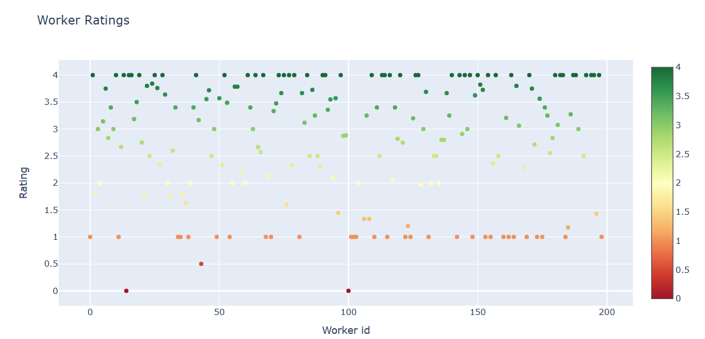
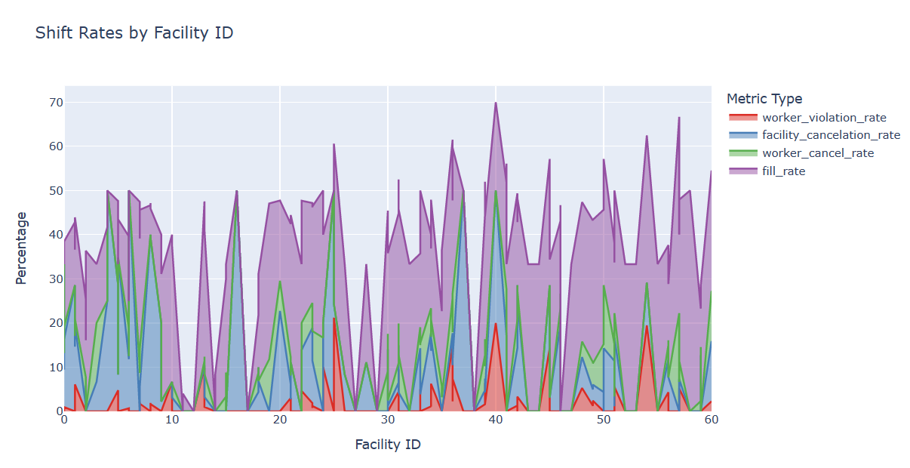
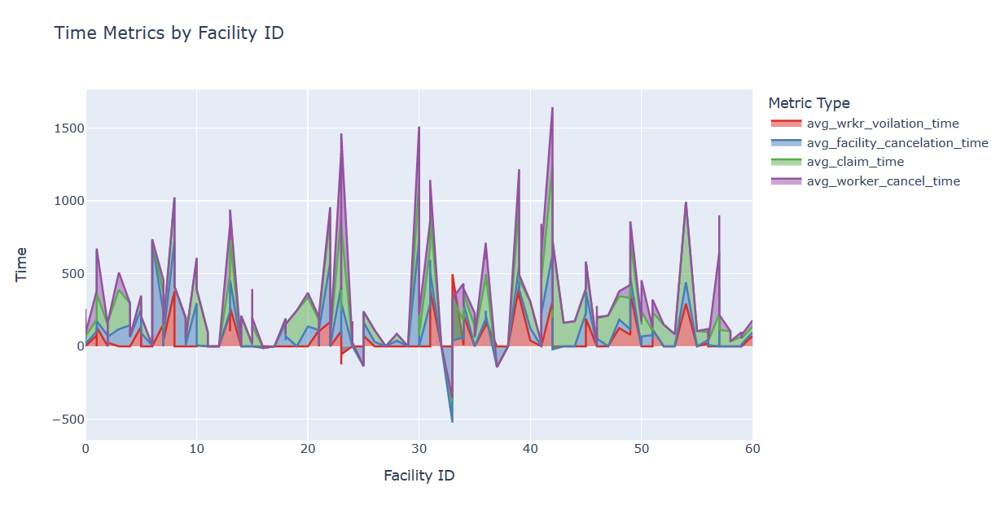
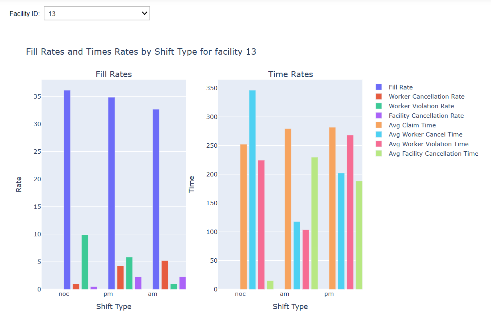
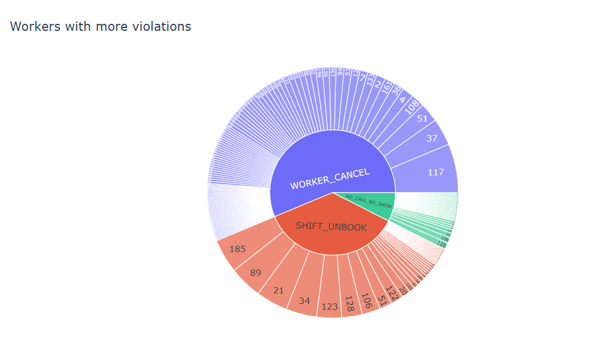
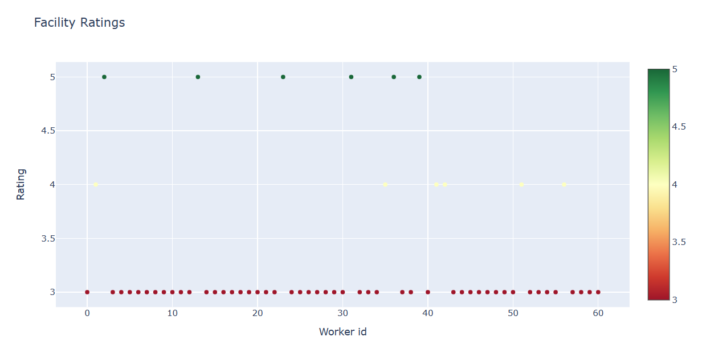
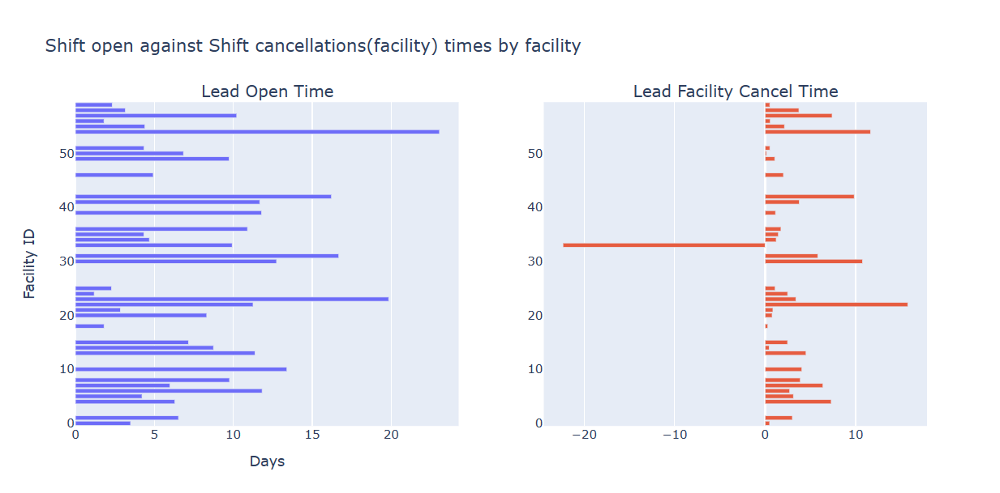

# **Clipboard Challenge**

Healthcare metrics are essential for tracking and improving the quality of healthcare facilities (HCFs) and healthcare professionals (HCPs). In this document, we will discuss the most important metrics for HCFs and HCPs, along with a feature proposal to improve fill rates for HCFs.

The most important Metrics are 
1. **Worker rating**
2. **Facility rating**
3. **Shift fill rates**
4. **Worker cancellation rates**

**Feature Proposal**:
    ``One feature that could move the Fill Rate for HCFs metric would be to implement a better rating system for HCPs. This rating system would allow HCFs to rate the HCPs they've worked with based on factors such as reliability, professionalism, and communication. HCFs would be more likely to book HCPs with higher ratings, which would increase the likelihood of their shifts being filled by reliable and trustworthy HCPs.``

## Table of Contents

- [HCF Metrics](#hcf-metrics)
  - [Worker Rating](#worker-rating)
  - [Shift Action Rate](#shift-action-rate)
  - [Time Taken to Fill Shifts](#time-taken-to-fill-shifts)
  - [Worker Performance](#worker-performance)
- [HCP Metrics](#hcp-metrics)
  - [Facility Ratings](#facility-ratings)
  - [Lead Times for Shift Open and Shift Cancellation](#lead-times-for-shift-open-and-shift-cancellation)

--------------------
## **HCF Metrics**

### *Worker Rating*
    Worker rating is one of the most important metrics for HCFs, as it helps them validate workers before the start of the shift. Cancellations can be disruptive and costly for HCFs, and they need to be able to rely on the HCPs they've booked. The following scores are awarded based on worker performance:

    The following scores are awarded 
        - Shift verify : 4
        - worker cancel : 1
        - worker violation : 1
        - no show no call : 0

    Workers with low ratings can be restricted from applying for more shifts, which helps to reduce worker cancellation rates. A better rating system for HCPs could also help increase fill rates, as HCFs would be more likely to book HCPs with higher ratings.

    

### *Shift action rate*
    Shift action rate measures the percentage of shifts that get filled by HCPs after being posted on the marketplace. A high fill rate indicates that HCFs are able to easily find suitable HCPs for their shifts, and vice versa. The following rates are calculated: 
    - Shift fill rate
    - Worker cancel rate
    - worker violation rate
    - facility cancelation rate
    
    

### *Time taken to fill shifts*
    Time to fill shifts is another crucial metric for HCFs. The following lead times are calculated:
    - shift claim
    - worker cancel  
    - worker violation  
    - facility cancelation
  

We can use the above metrics to show the shift rates and average lead times for the above actions grouped by shift type.

### *Worker performance*

Calculating workers with the most violations, cancellations, and no-shows can help identify them and place temporary bans or limit their ability to apply for shifts more often.

----------------------------------

## **HCP Metrics**

### *facility ratings*

Similar to worker ratings, facilities can also be rated based on the number of shifts posted, shifts filled, cancellation rate, and lead time before each facility takes action. Higher shifts posting and filling rates show the availability of shifts to HCPs, while cancellations can be disruptive for them. Higher lead time can help HCPs apply for another shift.

### *lead times for shift open and shift cancellation*

Higher shift open time  can help HCP's to plan their schedule accordingly , lower cancellation times leads to HCP's with no other shift in near time to book

 

